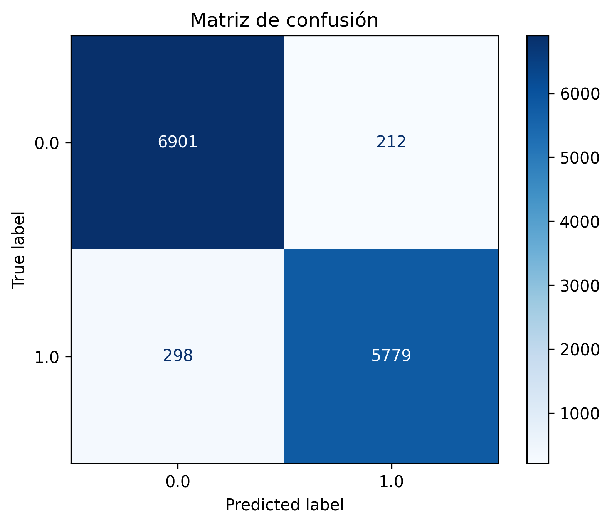

# Informe2-IA
Informe 2 correspondiente a la materia Inteligencia Artificial (SI3003) de la Universidad EAFIT

## 1. Descripción del dataset
- **Fuente**: este dataset proporciona información acerca de algunas aerolíneas y las calificaciones que los usuarios le dan a varios aspectos del viaje (como la comodidad de las sillas, el servicio, el entretenimiento, etc.). El dataset fue sacado de la plataforma Kaggle y se puede acceder a través del siguiente [enlace](https://www.kaggle.com/datasets/efehandanisman/skytrax-airline-reviews?resource=download)

- **Número de registros**: al cargar inicialmente la base de datos a un dataframe de pandas se observa que el dataset tiene 17 columnas y 131895 filas. Sin embargo, mirando por encima el archivo csv, vimos que los autores ponían datos en una fila y la siguiente la dejaban vacía (se intercalaba una fila de datos y una fila vacía). Entonces, después de eliminar estas filas vacías, quedamos con un dataset de 17 columnas y 65947 filas.

- **Variables**: a continuación se describen las variables que contiene el dataset:
  1. *airline* (string): nombre de la aerolínea.
  2. *overall* (float): calificación general del viaje en una escala de 1 a 10.
  3. *author* (string): autor del viaje.
  4. *review_date* (string): fecha de la reseña.
  5. *customer_review* (string): texto libre de la reseña del cliente.
  6. *aircraft* (string): tipo de aeronave.
  7. *traveller_type* (string): tipo de viajero (por ejemplo viaje de negocios o viaje por ocio).
  8. *cabin* (string): cabina en la que se encontraba el cliente en el vuelo.
  9. *route* (string): la ruta del viaje (ciudad de destino y ciudad de fin).
  10. *date_flown* (string): fecha del vuelo.
  11. *seat_comfort* (float): puntaje de comodidad del asiento en una escala de 1 a 5.
  12. *cabin_service* (float): puntaje de servicio en la cabina en una escala de 1 a 5.
  13. *food_bev* (float): puntaje de la comida y las bebidas en una escala de 1 a 5.
  14. *entertainment* (float): puntaje de entretenimiento en una escala de 1 a 5.
  15. *ground_service* (float): puntaje de servicio en tierra en una escala de 1 a 5.
  16. *value_for_money* (float): puntaje del valor obtenido por el precio pagado en una escala de 1 a 5.
  17. *recommended* (string): si se recomienda o no la aerolínea. Esta es la etiqueta y es una variable binaria.

- **Objetivo del problema**: construir modelos de machine learning para predecir si se recomienda una aerolínea o no.

## 2. Preprocesamiento
Para el preprocesamiento del dataset se realizaron los siguientes pasos:
1. Se creó un dataframe de pandas con el csv del dataset.
2. Se eliminaron las filas vacías usando el método `dropna()`.
3. Se eliminan las columnas que no aportarán mucho valor al modelo. En este caso eliminamos las columnas de: author, review_date, customer_review, route y date_flown. Quedamos entonces con 12 variables de interés.
4. La variable aircraft no está estandarizada (hay texto con la primera letra en mayúscula y otros todo en minúscula, el mismo nombre de aeronave escrito de formas diferentes, texto que dice que se desconoce, entre muchos otros problemas). Se usaron expresiones regulares para tratar de dar homogeneidad a esta variable. Adicionalmente, los datos que aparecieran menos de 50 veces se agruparon en una categoría de "other", para facilitar el one-hot encoding más adelante.
5. La variable objetivo (label) es 'recommended', pero esta variable tenía datos de 'yes' y 'no', por lo que se realiza una transformación de esta columna para convertirlo en numérico (0: no, 1: yes).
6. Se realiza la división del dataset en los 3 conjuntos: entrenamiento, validación y prueba, tratando de mantener la proporción 60/20/20.
7. Se crean los pipelines para imputar datos faltantes, realizar la codificación de las variables categóricas y escalar las variables numéricas:
    - Imputación de datos faltantes: para las variables cuantitativas se imputaron los datos faltantes con la media, mientras que para las variables categóricas se utilizó la moda.
    - Codificación de las variables categóricas: para las variables nominales (airline, aircraft y traveller_type) usamos one-hot encoding. Para la variable ordinal (cabin), usamos ordinal encoding.
    - Escalado de las variables cuantitativas: se realiza porque no todas están en la misma escala (por ejemplo overall está en escala de 1 a 10 mientras que las otras calificaciones van de 1 a 5)

**Nota**: la aplicación de los pipelines se realiza después de dividir el dataset en los 3 conjuntos y se aplica el pipeline de manera independiente al conjunto de entrenamiento, validación y prueba para evitar data leakage

## 3. Entrenamiento de los modelos
1. **Modelo 1**:

2. **Modelo 2 - Red Neuronal**: Para el entrenamiento del modelo de red neuronal, se utilizó una arquitectura de red neuronal secuencial con Keras y TensorFlow. La configuración y los parámetros elegidos fueron los siguientes:

**Arquitectura del modelo:**

- Capas de entrada y ocultas: Una capa de entrada con 64 neuronas y función de activación ReLU para decidir si se activan o no cada una. Una segunda capa oculta con 32 neuronas. Se añadió una capa de Dropout del 50% para regularizar el modelo y evitar el sobreajuste apagando aleatoriamente neuronas y así obligar al modelo a buscar nuevos caminos en cada iteración.

- Capa de salida: Una sola neurona con función de activación Sigmoide para devolver respuestas de 0 o 1.

**Hiperparámetros de entrenamiento:**

- Optimizador: Adam, este tipo de optimizador es muy adecuado para problemas con gradientes ruidosos con muchas características y ajustar los pasos del aprendizaje.

- Función de pérdida: binary_crossentropy, que mide la diferencia entre las predicciones del modelo y las etiquetas verdaderas y en este caso para respuestas binarias.

- Métricas: La precisión (accuracy) se utilizó para monitorear el rendimiento y ver si el modelo está aprendiendo en cada época.

- Épocas: 30, para darle al modelo suficientes oportunidades para aprender.

- Tamaño del lote (batch_size): 32, numero intermedio para que el modelo no pierda la capacidad de generalizar las respuestas (aprenda los patrones en las reseñas de aerolíneas y no memorizar).

1. **Modelo 3 - XGBoost**: El tercer modelo utilizado fue el XGBoost, en el cual se entrenan varios árboles de decisión pero cada árbol aprende del anterior y trata de corregir los errores de los árboles pasados. Suele ser más preciso que un Random Forest. En este caso usamos la librería xgboost para usar el modelo. Los hiperparámetros fueron los siguientes:
    - *n_estimators*: es el número de árboles que vamos a usar. En este caso usamos 100.
    - *learning_rate*: es la tasa de aprendizaje. Es lo que contribuye cada árbol al resultado final y esto determina qué tan rápido aprende el modelo. Entre más pequeños sea este valor, significa que cada árbol corregirá menos errores del árbol anterior. Los valores usuales son entre 0.05 y 0.3. En nuestro caso usamos 0.1.
    - *max_depth*: es la profundidad máxima de cada árbol. En nuestro modelo está configurada en una profundidad máxima de 6.
    - *subsample*: es la cantidad de datos del set de entrenamiento que va a usar el modelo para entrenar cada árbol. En nuestro caso es de 0.8, es decir que para cada árbol el modelo toma al azar el 80% de los datos del set de entrenamiento.
    - *colsample_bytree*: es el porcentaje de columnas (atributos) que se usan para construir cada árbol (un concepto similar a subsample pero para las columnas). En este caso también se estableció en 0.8.
    - *random_state*: la semilla para generar números aleatorios y que el resultado sea reproducible.
    - *use_label_encoder*: es un parámetro que se usaba en versiones antiguas de XGBoost para manejar la codificación de las etiquetas (variables target). Por defecto debe ser False porque uno debe tener el control de la codificación de las etiquetas.
    - *eval_metric*: es la métrica que usa el modelo para evaluar su desempeño durante el entrenamiento. En este caso se usa 'logloss' que significa logarithmic loss y es una métrica utilizada para ver qué tan bien predice el modelo las probabilidades en un problema de clasificación.

## 4. Evaluación de resultados:
Usamos como métrica de rendimiento el accuracy por tratarse de un problema de clasificación. Una clasificación cercana al 100% indica una mejor clasificación. Basado en los resultados del accuracy con el conjunto de datos de validación y de prueba, podemos establecer el desempeño del modelo usado y por ende, predecir si se recomienda o no una aerolinea.
### 4.1 Métricas de rendimiento
1. **Modelo 1**:

2. **Modelo 2 - Red Neuronal**: NUestro modelo de Red Neuronal tuvo un accuracy de 95.6% durante la validación y un accuracy de 96.1% con el conjunto de prueba, lo que indica que el modelo tiene un buen desempeño

3. **Modelo 3 - XGBoost**: Nuestro modelo XGBoost tuvo un accuracy de 95.9% durante la validación y un accuracy de 96% con el conjunto de prueba, lo que indica un buen desempeño del modelo.

### 4.2 Curvas y Visualizaciones
- 1. **Modelo 1**:

- 2. **Modelo 2 - Red Neuronal**:

    **a. Matriz de confusión**:
    
    Como se puede observar, los valores en las predicciones correctas son significativamente altos, lo que confirma que el modelo predice los resultados verdaderos con un alto grado de exactitud. La cantidad de falsos positivos y falsos negativos es muy pequeña en comparación con el total de predicciones acertadas.

- 3. **Modelo 3 - XGBoost**:

  **a. Matriz de confusión**:
  
  Se puede observar que el modelo predice muy bien los valores verdaderos. La cantidad de falsos positivos y falsos negativos es muy pequeño en proporción a la cantidad de resultados acertados.
